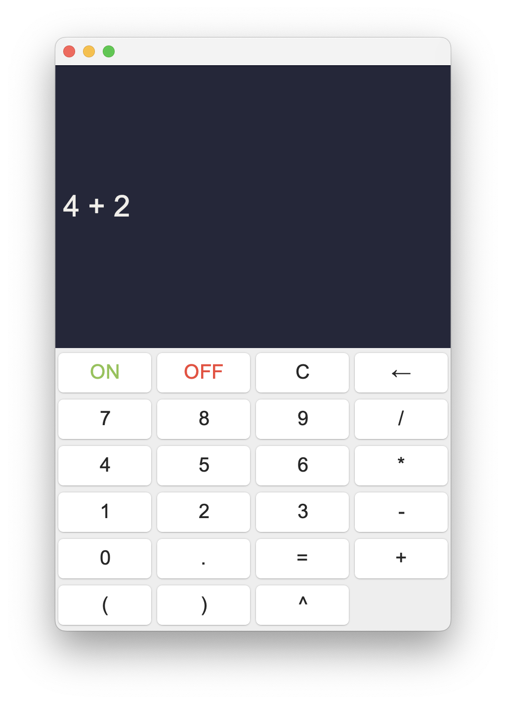
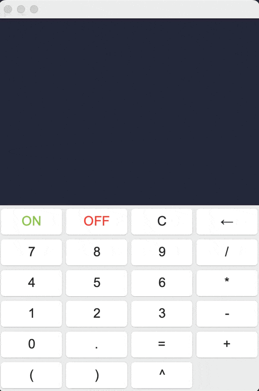

<body style="font-family: Arial, sans-serif; line-height: 1.6; max-width: 900px; margin: auto; padding: 20px;">

  

    <h3 style="margin-bottom: 10px;">Java Calculator with AWT</h3>
    
A simple calculator using Java AWT and postfix evaluation

  

  <h2>About The Project</h2>

  

    

      
    

    

      

        A simple yet functional calculator built using Java's Abstract Window Toolkit (AWT), which provides a classic GUI experience.
        This calculator supports basic arithmetic operations and utilizes Polish notation — converting infix expressions to postfix —
        for accurate evaluation of user input.
      

      <h4>Built With</h4>
      <ul>
        <li>Java (AWT)</li>
        <li>Stack-based Postfix Evaluation</li>
      </ul>
      <a href="#live-demo" style="text-decoration: none; font-weight: bold; color: #2e86de;">View Live Demo</a>
    

  

  

  <h2>Getting Started</h2>

  <h3>Prerequisites</h3>
  
Java JDK (8+ recommended)

  <pre><code>sudo apt install openjdk-17-jdk  # Ubuntu</code></pre>
  
Or download manually from <a href="https://www.oracle.com/java/technologies/javase-downloads.html" target="_blank">Oracle's website</a>.

  <h3>Installation</h3>
  <ol>
    <li>Clone the repository:
      <pre><code>git clone https://github.com/your_username/your_repo.git</code></pre>
    </li>
    <li>Compile the Java files:
      <pre><code>javac *.java</code></pre>
    </li>
    <li>Run the Calculator:
      <pre><code>java Calculator</code></pre>
    </li>
  </ol>

  

  <h2>Usage</h2>
  <ul>
    <li>Input using either the mouse or keyboard.</li>
    <li>Supports basic operators: <code>+</code>, <code>-</code>, <code>*</code>, <code>/</code>, <code>^</code></li>
    <li>Use parentheses <code>()</code> to control precedence.</li>
    <li>Press <code>=</code> or return key to evaluate the expression.</li>
    <li>Press <code>Ctrl + C</code> to clear or undo.</li>
    <li>Press <code>Backspace</code> to delete characters.</li>
    <li>Toggle ON/OFF state with the power buttons.</li>
  </ul>

  <h2 id="live-demo">Live Demo</h2>
  

  

  <h2>Roadmap</h2>
  <ul>
    <li>Basic Arithmetic Operations</li>
    <li>Postfix Evaluation</li>
    <li>GUI Keyboard Support</li>
  </ul>
  
See <a href="https://github.com/gwynejsn/java-awt-calculator/issues" target="_blank">Issues Page</a> for more.

  

  <h2>Contributing</h2>
  
Contributions are welcome! Fork the repo and open a pull request.

  <ol>
    <li>Fork it</li>
    <li>Create a feature branch: <code>git checkout -b feature/NewFeature</code></li>
    <li>Commit your changes: <code>git commit -m 'Add new feature'</code></li>
    <li>Push to the branch: <code>git push origin feature/NewFeature</code></li>
    <li>Open a Pull Request</li>
  </ol>

  

  <h2>Project Link</h2>
  

    <a href="https://github.com/gwynejsn/java-awt-calculator.git" target="_blank">https://github.com/gwynejsn/java-awt-calculator.git</a>
  

</body>
